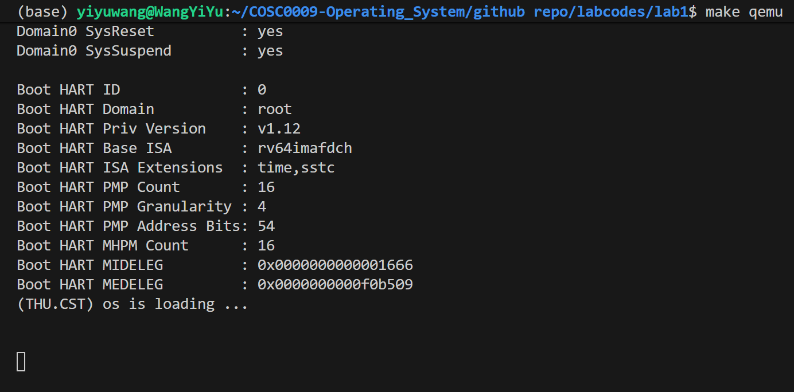
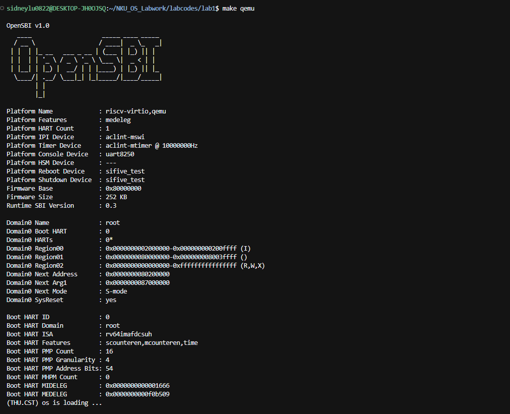
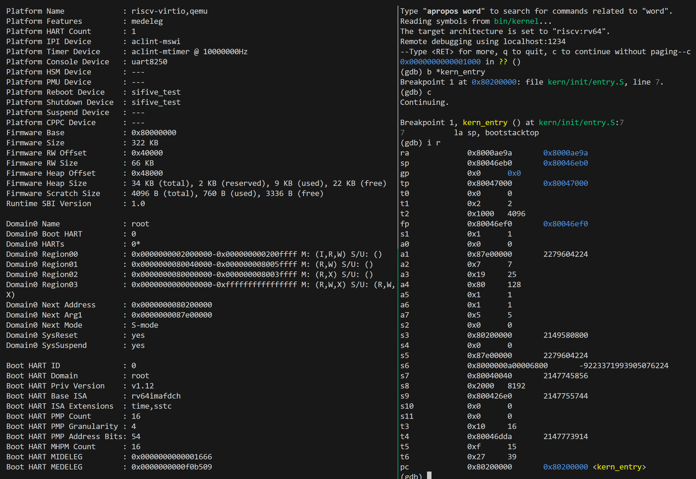
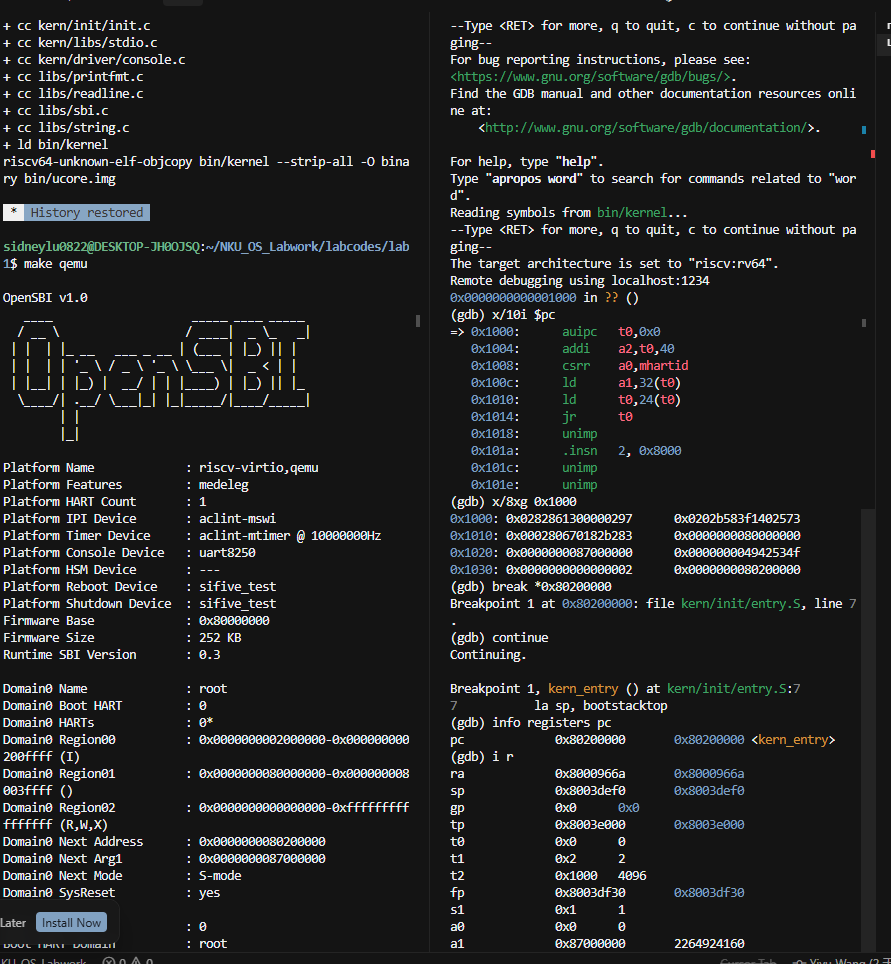

# 操作系统实验报告

## 实验基本信息

| 项目 | 内容 |
|------|------|
| **实验名称** | Lab 1: 比麻雀更小的麻雀（最小可执行内核） |
| **小组成员** | 2414007-王奕瑜、2414015-鲁昕宁、2411622-张雨函 |
| **完成日期** | 2026-10-8 |

### 小组分工

练习如何分工？

| 成员 | 负责的练习/模块 |
|:------:|:----------------:|
| 2414007-王奕瑜 | 练习 4.2  |
| 2414015-鲁昕宁 | 练习 4.3  |
| 2411622-张雨函 |   |

实验报告如何分工？

| 成员 | 负责的实验报告内容 |
|:------:|:----------------:|
| 2414007-王奕瑜 | 五、测试与验证  |
| 2414015-鲁昕宁 | 一、实验目的 三、实验整体逻辑分析 六、实验总结与收获 |
| 2411622-张雨函 |   |
---

## 一、实验目的


本实验的主要目的是：

1. 学习交叉编译以生成系统镜像
2. 学习 GDB 调试与内存布局
3. 了解 OpenSBI 固件，探索操作系统如何启动

---

## 二、实验环境

你们使用的 AI 工具

| 成员 | AI 编程工具 | 底层模型 | 备注 |
|:------:|:------------:|:---------:|:------:|
| 2414007-王奕瑜 | Claude Code | GLM 5.3 | 无  |
| 2414015-鲁昕宁 | Cursor | Grok 4.7 | 无 |
| 2411622-张雨函 | | | |

**说明：**
- **AI 编程工具**：指具体使用的终端工具、编辑器插件、桌面应用或浏览器界面
- **底层模型**：指该工具使用的大语言模型及版本

---

## 三、实验整体逻辑分析

### 2.1 本章节的逻辑主线

本章的主线是“操作系统如何启动”。要启动一个操作系统，首先我们应该准备好一个镜像，通常我们可以直接获取可分发的镜像文件（如iso格式），在 BIOS 中设置由磁盘引导实现安装、启动；而在本实验中，我们需要直接由源码编译得到系统镜像。通常的个人PC、服务器使用的系统镜像面向x86平台，而本实验的系统需要在QEMU模拟出的riscv64环境下运行，开发环境、宿主机仍为x86平台，这就需要面向riscv64的交叉编译工具链。与在物理机上安装系统同理，我们不仅需要支持系统软件的环境，还需要引导启动的固件，OpenSBI 便实现了此功能，使得我们可以模拟系统在启动时的引导。

凭借 GDB 调试与反汇编，我们可以深入探索系统启动过程中的指令、数据流以及基本的内存布局。进一步分析指令功能，便可逐步解读系统启动的流程。

### 2.2 功能的逐步实现

本实验无功能需要实现。

---

## 四、实验内容与实现

### 4.1  实验内容与流程

**负责人：** [学号-姓名]


### 4.2  练习：理解内核启动中的程序入口操作

> 阅读 `kern/init/entry.S` 内容代码，结合操作系统内核启动流程，说明指令 `la sp` , bootstacktop 完成了什么操作，目的是什么？ `tail kern_init` 完成了什么操作，目的是什么？

**负责人：** 2414007-王奕瑜

**回答：**

`kern/init/entry.S` 是 OpenSBI 跳转到 0x80200000 后执行的第一段代码（链接脚本把 `.text.kern_entry` 放在输出 `.text` 段的最开头，且段基址为 0x80200000，因此内核第一条指令就是 `kern_entry` 处的指令）。它只有两条指令：

**（1）`la sp, bootstacktop` 完成的操作与目的**

- **操作**：`la` 是"加载地址"伪指令，它把链接器符号 `bootstacktop` 的地址装入栈指针寄存器 `sp`。`bootstacktop` 是在 `entry.S` 的 `.data` 段中静态分配的内核栈（`bootstack: .space KSTACKSIZE`，2 页共 8KB，按 `PGSHIFT` 对齐到页边界）的高地址端。该伪指令会被汇编器展开为 `auipc sp, 0x3` + `addi sp, sp, 0x1000` 两条实际指令（我们用 GDB 单步验证过：执行后 `sp = 0x80203000`，与 `info address bootstacktop` 输出一致）。
- **目的**：为 C 语言建立运行环境中最关键的一步——设置内核栈。C 语言的函数调用依赖栈来保存返回地址、局部变量和被调用者保存寄存器，没有合法的 `sp` 就无法调用任何 C 函数。OpenSBI 跳转过来时留下的 `sp` 属于固件的栈，内核不能依赖它。由于 RISC-V 的栈从高地址向低地址增长，所以把 `sp` 初始化在栈区的高地址端 `bootstacktop`. 初始时栈为空，之后每次压栈只会向低地址推进，最多用到 `bootstack` 处，不会越界。这样 `kern_init` 一进来就可以安全地执行函数调用。

**（2）`tail kern_init` 完成的操作与目的**

- **操作**：`tail` 表示尾调用，它被汇编为一条 `j kern_init` 跳转指令。与普通 `call` 的区别是：它只跳转、不把返回地址压栈/写入 ra，即不保留任何返回到 entry.S的路径。
- **目的**：把 CPU 的控制权干净、单向地移交给 C 语言编写的内核初始化函数 `kern_init`。因为 `kern_entry` 是整个内核的最底层入口，它上面没有任何调用者，`kern_init` 正常情况下永不返回（其内部最终是 `while(1)` 死循环），使用尾调用既表达了这个语义，也避免了无意义的返回地址保存（如果用 `call`，ra 会在栈上留下一个永远不会被用到的返回地址）。

---

### 4.3  练习：使用GDB验证启动流程

> 为了熟悉使用 QEMU 和 GDB 的调试方法，请使用 GDB 跟踪 QEMU 模拟的 RISC-V 从加电开始，直到执行内核第一条指令（跳转到 0x80200000）的整个过程。通过调试，请思考并回答：RISC-V 硬件加电后最初执行的几条指令位于什么地址？它们主要完成了哪些功能？请在报告中简要记录你的调试过程、观察结果和问题的答案。

**负责人：** 2414015-鲁昕宁

**回答：**

用 Cursor 的终端拆分功能替代 `tmux`。先在一个终端运行 `make debug`：QEMU 以 `-s` 监听 1234 端口，并以 `-S` 冻结 CPU、等待 GDB。再在另一个终端运行 `make gdb`：加载 `bin/kernel` 的符号，设置架构 `riscv:rv64`，连接到 `localhost:1234`。`make qemu` 会直接把内核跑完，不用于这次跟踪。

连接成功后 GDB 停在：

```txt
0x0000000000001000 in ?? ()
```

这是 QEMU virt 机器的复位地址，说明加电后的 PC 就是 `0x1000`。

接着在 GDB 中执行 `x/10i $pc`，从当前指令地址起反汇编 10 条指令；再执行 `x/8xg 0x1000`，把 `0x1000` 起的内存按 8 个 64 位十六进制数打印，每行 16 字节。

**（1）RISC-V 硬件加电后最初执行的几条指令的地址**
| 指令                | 地址   |
| ------------------ | ------ |
| `auipc t0, 0x0`    | 0x1000 |
| `addi a2, t0, 40`  | 0x1004 |
| `csrr a0, mhartid` | 0x1008 |
| `ld a1, 32(t0)`    | 0x100c |
| `ld t0, 24(t0)`    | 0x1010 |
| `jr t0`            | 0x1014 |

**（2）RISC-V 硬件加电后内存中的原始值**
|行基址|数据（低8字节，高位-低位）|数据（高8字节，高位-低位）|
|------|----------|----------|
|0x1000|0x0282861300000297|0x0202b583f1402573|
|0x1010|0x000280670182b283|**0x0000000080000000**|
|0x1020|0x0000000087000000|0x000000004942534f|
|0x1030|0x0000000000000002|**0x0000000080200000**|

**（3）RISC-V 硬件加电后最初执行的几条指令的功能**
| 指令                 | 效果                                             |
| ------------------ | ---------------------------------------------- |
| `auipc t0, 0x0`    | t0 = 0x1000（当前 PC），作为访问 ROM 数据的基址              |
| `addi a2, t0, 40`  | a2 = 0x1028，指向 QEMU 为 fw_dynamic 准备的配置结构       |
| `csrr a0, mhartid` | a0 = 当前硬件线程号（hart 0）                           |
| `ld a1, 32(t0)`    | a1 = `*(0x1020)` = 0x87000000，设备树（DTB）地址       |
| `ld t0, 24(t0)`    | t0 = `*(0x1018)` = **0x80000000**，OpenSBI 固件入口 |
| `jr t0`            | 跳转到 0x80000000。a0、a1、a2 已由前面的指令装好，jr 只负责跳转 |

`0x1018` 处是 OpenSBI 入口 `0x80000000`，`0x1020` 处是设备树地址。`0x1028` 起是 fw_dynamic 配置结构：魔数 `OSBI`、版本号 2、下一跳地址 `0x80200000`。这组指令只做两件事：取出这些参数，再跳到 `0x80000000`。OpenSBI 的初始化不在这几条指令里。

本机 QEMU 7.0.0 把设备树放在 `0x87000000`。成员 2414007 的 QEMU 8.2.2 放在 `0x87e00000`，差在内存末尾的对齐方式，启动路径相同。

**（4）继续执行到内核第一条指令**

`0x1000` 处的代码不会直接进入内核。在 GDB 中对内核入口下断点后再放行：

```txt
(gdb) break *0x80200000
Breakpoint 1 at 0x80200000: file kern/init/entry.S, line 7.
(gdb) continue
Breakpoint 1, kern_entry () at kern/init/entry.S:7
7	    la sp, bootstacktop
(gdb) info registers pc
pc    0x80200000	0x80200000 <kern_entry>
```

`continue` 之后，CPU 从 `0x1000` 跳到 `0x80000000`。OpenSBI 在这里完成初始化，再把 PC 交到 `0x80200000`。断点命中 `kern_entry` 的第一条指令 `la sp, bootstacktop`，说明控制权已经转到链接脚本指定的内核入口。

另一次干净的 `make debug` 中，手册里的 `watch *0x80200000` 在整个启动过程里没有触发，先命中的是同一地址上的断点。使用 `-kernel` 时，QEMU 在 CPU 执行第一条指令之前就把内核放进了 `0x80200000`，运行过程中没有对这个地址的写入。因此本实验用 `break *0x80200000` 确认内核开始执行。
---

## 五、测试与验证


### 5.1  编译及运行成功的输出（`make qemu`）

终端截图如下：




### 5.2  GDB 断点命中 kern_entry

终端截图如下：




---

## 六、实验总结与收获

### 6.1  对操作系统的理解

1. 本实验中重要的知识点，以及 OS 原理中知识点的对应与差异：
- 从 0x1000 经 OpenSBI 跳到 0x80200000，对应 OS 原理中的系统引导，差异是用 OpenSBI 引导，镜像直接由 QEMU 加载入内存，而非物理机用 UEFI 固件从磁盘上引导启动
- OpenSBI 体现了对硬件的抽象，但本实验没有涉及到对常见硬件设备（例如输入输出设备）驱动的开发

2. OS 原理中很重要、但在本实验中没有对应上的知识点：
- 中断与系统调用（没有涉及到应用以及外部设备的中断和与系统内核的通讯）
- 文件系统（只装载了包含系统内核的镜像）

### 6.2  AI 协作开发的经验

1. AI 在小型项目的开发中，从环境依赖配置方面带来的效率提升最大；
2. AI 方便解读因环境不同所致的实验结果的细微差异，虽然这些差异不影响实验对象的功能、实验结果的解读，但当项目规模上升时，会引发潜在的困惑，如设备树地址：
> QEMU 在启动前把设备树放在默认 128MB 内存的末尾附近（内存范围是 0x80000000–0x88000000），具体落点取决于版本里的对齐方式：
2414015 的 QEMU 是 7.0.0，按 16MB 向下对齐，所以是 0x87000000。
2414007 的 QEMU 是 8.2.2，按 2MB 向下对齐，所以是 0x87e00000。

3. AI 适合通过交互式对话修正对一些概念理解的偏差
---

